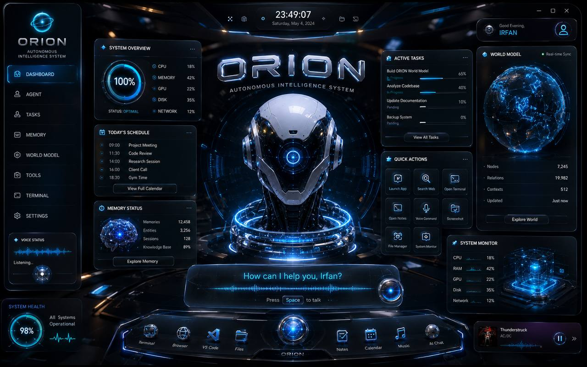

<p align="center">
  
</p>

<p align="center">
  
  
  
  
  
  
</p>

<p align="center">
  
  
  
  
</p>

---

<h1 align="center">⚡ ORION ⚡</h1>
<h3 align="center">Autonomous Adaptive OS Agent</h3>
<p align="center">
  <em>A production-grade, self-healing, multi-agent AI system that understands its environment,<br>
  adapts to hardware, responds to voice, and learns from its mistakes.</em>
</p>

<p align="center">
  <a href="#-architecture">Architecture</a> •
  <a href="#-tech-stack">Tech Stack</a> •
  <a href="#-current-progress">Progress</a> •
  <a href="#-project-structure">Structure</a> •
  <a href="#-getting-started">Getting Started</a> •
  <a href="#-for-ai-agents">AI Agents</a>
</p>

---

## 🧠 What is ORION?

ORION is not just a chatbot. It's an **autonomous operating system agent** that:

- 🔍 **Understands** its environment — files, processes, network, hardware
- 🧬 **Adapts** to available resources — CPU, RAM, GPU, internet
- 🛡️ **Self-heals** — detects corruption, repairs dependencies, recovers from crashes
- 🎙️ **Listens** — voice-first interaction with wake-word detection
- 📱 **Responds** — remote control via Telegram, REST API, WebSocket
- 🧠 **Learns** — from failures, user patterns, and workflow templates
- 🔐 **Respects** — user-controlled permissions, no hidden policies

<p align="center">
  
  
  
  
  
  
  
</p>

---

## 🏗️ Architecture

```
┌─────────────────────────────────────────────────────────────────────┐
│                        ORION ARCHITECTURE                          │
├─────────────────────────────────────────────────────────────────────┤
│                                                                     │
│   ┌──────────┐  ┌──────────┐  ┌──────────┐  ┌──────────────────┐  │
│   │ Telegram │  │ REST API │  │  Voice   │  │  Desktop GUI     │  │
│   │   Bot    │  │  Server  │  │  System  │  │  (Tauri + React) │  │
│   └────┬─────┘  └────┬─────┘  └────┬─────┘  └────────┬─────────┘  │
│        │              │              │                 │            │
│        └──────────────┴──────┬───────┴─────────────────┘            │
│                              │                                      │
│                    ┌─────────▼──────────┐                           │
│                    │    EVENT BUS       │ ◄── Central Nervous       │
│                    │  (Async Pub/Sub)   │     System                │
│                    └─────────┬──────────┘                           │
│                              │                                      │
│        ┌─────────────────────┼─────────────────────┐                │
│        │                     │                     │                │
│  ┌─────▼──────┐  ┌──────────▼─────────┐  ┌───────▼────────┐       │
│  │  Adaptive  │  │   State Machine    │  │  4-Tier Memory │       │
│  │  Runtime   │  │   + Task Queue     │  │  Architecture  │       │
│  │            │  │                    │  │                │       │
│  │ • Hardware │  │ • IDLE             │  │ • Session      │       │
│  │ • Mode     │  │ • PROCESSING       │  │ • Long-Term    │       │
│  │ • Monitor  │  │ • PAUSED           │  │ • Episodic     │       │
│  │ • Modules  │  │ • ERROR/SHUTDOWN   │  │ • Semantic     │       │
│  └────────────┘  └────────────────────┘  └────────────────┘       │
│                                                                     │
│  ┌────────────────────────────────────────────────────────────┐    │
│  │                    PHASE 2+ (Future)                       │    │
│  │  Vision Engine • Browser • LLM Router • Knowledge Graph   │    │
│  │  Self-Healing • Learning • Skills • Plugins • Workflow     │    │
│  └────────────────────────────────────────────────────────────┘    │
│                                                                     │
└─────────────────────────────────────────────────────────────────────┘
```

---

## 🛠️ Tech Stack

<table>
<tr>
<td align="center"><b>Layer</b></td>
<td align="center"><b>Technology</b></td>
<td align="center"><b>Purpose</b></td>
</tr>
<tr>
<td>🧠 AI Engine</td>
<td>Python 3.13+, FastAPI, Pydantic, asyncio</td>
<td>Core intelligence, LLM integration, automation</td>
</tr>
<tr>
<td>⚡ Performance</td>
<td>Rust (Tokio, notify, sysinfo)</td>
<td>Hardware detection, background services, low CPU</td>
</tr>
<tr>
<td>🖥️ Desktop GUI</td>
<td>Tauri v2 + React + TypeScript + TailwindCSS</td>
<td>Jarvis-style floating orb interface</td>
</tr>
<tr>
<td>💾 Storage</td>
<td>SQLite + ChromaDB/Qdrant + Redis</td>
<td>State, vector memory, caching</td>
</tr>
<tr>
<td>🎙️ Voice</td>
<td>faster-whisper, Kokoro/Piper, Porcupine</td>
<td>Speech-to-text, text-to-speech, wake word</td>
</tr>
<tr>
<td>🌐 Browser</td>
<td>Playwright</td>
<td>Web automation, research, scraping</td>
</tr>
<tr>
<td>📱 Remote</td>
<td>Telegram Bot, REST API, WebSocket</td>
<td>Remote control from any device</td>
</tr>
</table>

---

## 📊 Current Progress

> **Phase 1: Core Foundation** — 40% Complete

<table>
<tr>
<td align="center"><b>Milestone</b></td>
<td align="center"><b>Status</b></td>
<td align="center"><b>Tests</b></td>
<td align="center"><b>Description</b></td>
</tr>
<tr>
<td>M1.1</td>
<td align="center">✅</td>
<td align="center">28</td>
<td>Event Bus & Agent Registry</td>
</tr>
<tr>
<td>M1.2</td>
<td align="center">✅</td>
<td align="center">23</td>
<td>State Machine & Task Queue</td>
</tr>
<tr>
<td>M1.3</td>
<td align="center">✅</td>
<td align="center">33</td>
<td>4-Tier Memory Architecture</td>
</tr>
<tr>
<td>M1.4</td>
<td align="center">✅</td>
<td align="center">42</td>
<td>Adaptive Runtime</td>
</tr>
<tr>
<td>M1.5</td>
<td align="center">⏳</td>
<td align="center">—</td>
<td>Self-Healing Architecture</td>
</tr>
<tr>
<td>M1.6</td>
<td align="center">🔒</td>
<td align="center">—</td>
<td>Observability & Metrics</td>
</tr>
</table>

```
Progress: ████████████████░░░░░░░░░░░░░░░░░░░░░░░░ 40%

Tests:     126 / 126 passing ✅
Demos:     5 / 5 working ✅
Stability: PASSED ✅
```

---

## 📂 Project Structure

```
ORION/
├── orion/                          # Python AI Engine
│   ├── core/
│   │   ├── communication/          # EventBus + AgentRegistry
│   │   ├── state/                  # StateMachine + TaskQueue
│   │   └── runtime/                # AdaptiveRuntime ✨
│   ├── memory/                     # 4-Tier Memory System
│   │   ├── session_memory.py       # LRU + TTL
│   │   ├── long_term_memory.py     # SQLite + FTS5
│   │   ├── episodic_memory.py      # Experience logging
│   │   ├── semantic_memory.py      # Vector search
│   │   └── memory_manager.py       # Unified interface
│   ├── contracts/                  # Pydantic models (21 files)
│   ├── remote_control/             # Telegram Bot
│   └── [20+ future modules]/       # Vision, Browser, LLM, etc.
│
├── tests/                          # Test Suite (126 tests)
│   ├── core/                       # EventBus + State tests
│   ├── memory/                     # Memory tests
│   └── runtime/                    # AdaptiveRuntime tests
│
├── examples/                       # Working Demos
├── config/                         # YAML Configuration
├── state/                          # Runtime State (JSON)
├── docs/                           # ADRs
├── scripts/                        # Stability Check
│
├── CLAUDE.md                       # 🧠 Engineering Constitution
├── SESSION_START.md                # AI Agent session instructions
├── PROGRESS_TRACKER.md             # Milestone tracking
├── BUILD_GUIDE.md                  # Build rules
└── ROADMAP.md                      # Full development roadmap
```

---

## 🚀 Getting Started

```bash
# Clone the repository
git clone https://github.com/irfan420x/ORION-Autonomous-Agent.git
cd ORION-Autonomous-Agent

# Install dependencies
pip install -r requirements.txt

# Run tests
python -m pytest tests/ -v

# Run stability check
bash scripts/stability_check.sh

# Try a demo
python examples/event_bus_demo.py
python examples/memory_demo.py
python examples/state_task_queue_demo.py
```

---

## 🤖 For AI Agents

> **If you are Claude Code, Codex, or Cursor — read this carefully.**

| Step | Action |
|------|--------|
| 1 | Read `CLAUDE.md` — your Engineering Constitution |
| 2 | Read `SESSION_START.md` — current session instructions |
| 3 | Read `PROGRESS_TRACKER.md` — what's done, what's next |
| 4 | Read `state/project_state.json` — current state |
| 5 | Follow the Build Order — Phase 1 → Phase 7 |
| 6 | Run `./scripts/stability_check.sh` before committing |

**Rules:**
- ❌ Never skip phases
- ❌ Never commit broken tests
- ✅ Always use EventBus for inter-module communication
- ✅ Always write typed code with docstrings
- ✅ Always update Telegram bot with new commands

---

## 📡 Telegram Bot Commands

```
/start, /help, /status, /ping        — Basic commands
/state, /transitions, /setstate      — State Machine
/tasks, /addtask, /completetask      — Task Queue
/memory, /remember, /recall, /forget — Memory System
/events, /stats                      — EventBus
/runtime, /resources, /modules       — Adaptive Runtime ✨
```

---

## 🗺️ Roadmap

| Phase | Focus | Status |
|-------|-------|--------|
| **Phase 1** | Core Foundation | 🔄 40% |
| **Phase 2** | Intelligence Layer | 🔒 |
| **Phase 3** | Voice & Vision | 🔒 |
| **Phase 4** | Learning & Knowledge | 🔒 |
| **Phase 5** | Desktop GUI (Jarvis UX) | 🔒 |
| **Phase 6** | Remote Control & API | 🔒 |
| **Phase 7** | Plugin SDK & Distribution | 🔒 |

---

## 👤 Author

**IRFAN** — [GitHub](https://github.com/irfan420x)

<p align="center">
  
</p>

---

## 📄 License

MIT License — see [LICENSE](LICENSE) for details.

<p align="center">
  <sub>⚡ ORION — The agent that thinks, adapts, and evolves. ⚡</sub>
</p>
